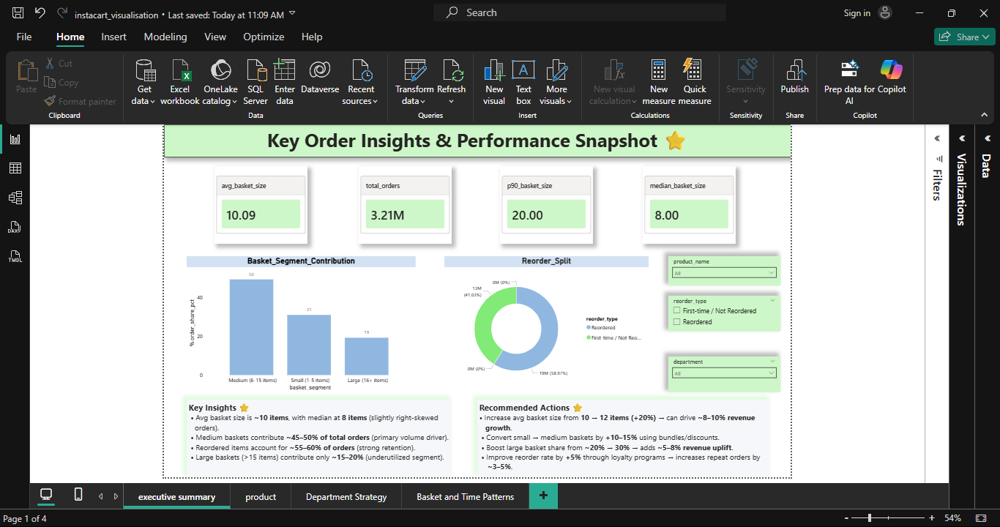
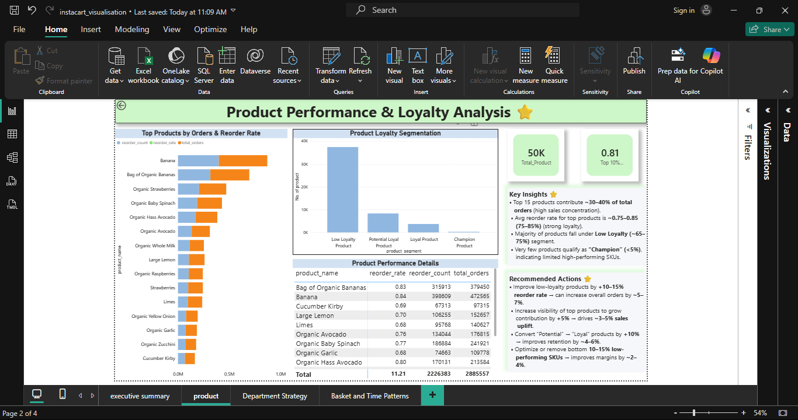
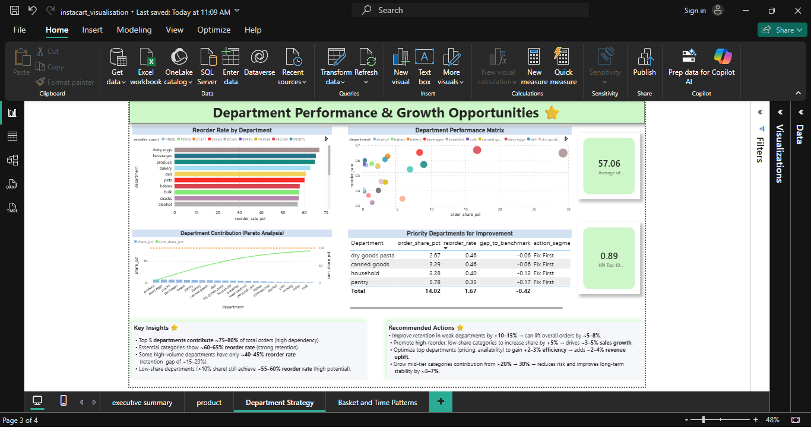
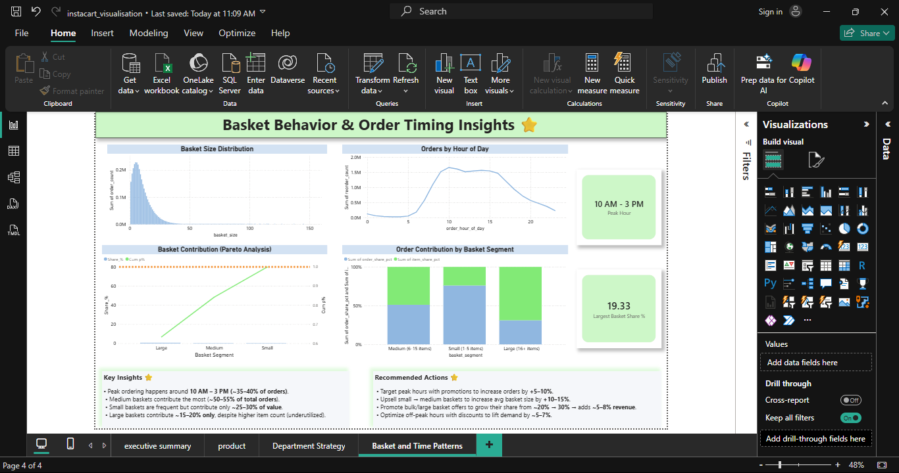

# 🛒 Instacart Business Insights Analytics  
### End-to-End ETL + SQL + Power BI Data Analytics Project


---

# 🧩 Business Problem

Instacart generates massive volumes of transactional order data, but lacks clear visibility into:

- Customer purchasing behavior  
- Product-level contribution to revenue  
- Department performance and growth gaps  
- Basket size impact on sales  
- Peak ordering patterns  

Without structured analytics, it becomes difficult to answer:

- What drives higher order volume?  
- Which products and departments generate the most value?  
- How customer behavior influences revenue?  
- Where growth opportunities exist in the business?  

This limits the ability to design **data-driven strategies for revenue growth, retention, and operational efficiency**.

---

# 🎯 Solution / Analytical Approach

An **end-to-end analytics pipeline** was developed using **Python, SQL, and Power BI** to transform raw data into business insights.

---

## 1️⃣ Data Engineering (ETL Pipeline)

Using **Python (Pandas)**:

- Data cleaning and preprocessing  
- Handling missing and inconsistent values  
- Transforming raw datasets into analysis-ready format  
- Building a structured pipeline for repeatable data processing  

---

## 2️⃣ Data Modeling (Star Schema)

A **Star Schema** was designed to optimize analytical performance:

- Fact table: Orders / Transactions  
- Dimension tables: Products, Departments, Customers, Time  

This enabled:

- Faster query execution  
- Scalable analytics  
- Better integration with BI tools  

---

## 3️⃣ Business Analysis (SQL)

Advanced SQL techniques were used:

- Complex joins across fact & dimension tables  
- Aggregations for sales and behavior analysis  
- Query optimization (SQL tuning) for performance  
- Segmentation of baskets, products, and departments  

---

## 4️⃣ Visualization (Power BI)

Interactive dashboards were built to analyze:

- Customer order patterns  
- Product performance  
- Department contribution  
- Basket behavior & peak order timing  

---

# 📊 Dashboard Overview

### 🔹 Executive Summary


**Key Highlights:**
- Avg basket size ≈ 10 items  
- Medium baskets contribute ~45–50% of orders  
- Reorders ~55–60% → strong customer retention  

---

### 🔹 Product Performance & Loyalty Analysis


**Key Insights:**
- Top products contribute ~30–40% of total orders  
- High reorder rates (0.75–0.85) indicate strong loyalty  
- Majority of products fall under low loyalty segment  

---

### 🔹 Department Performance & Growth Opportunities


**Key Insights:**
- Top 5 departments contribute ~75–80% of total orders  
- Several low-share departments show high growth potential  
- Opportunity for category-level optimization  

---

### 🔹 Basket Behavior & Order Timing


**Key Insights:**
- Peak ordering time: **10 AM – 3 PM**  
- Medium baskets drive majority revenue (~50–55%)  
- Large baskets are underutilized  

---

# 📈 Business Insights

### Customer Behavior
- High reorder rate indicates strong retention  
- Customers prefer medium-sized baskets  

### Revenue Distribution
- Revenue is concentrated in a limited set of products & departments  
- Indicates dependency risk  

### Growth Opportunities
- Low-performing departments show improvement potential  
- Large baskets represent untapped revenue  

### Demand Patterns
- Clear peak-hour ordering window  
- Opportunity for time-based promotions  

---

# 💡 Business Recommendations

- 🎯 Run promotions during peak hours to increase conversions  
- 📦 Upsell medium baskets into large baskets  
- 🛒 Focus on high-performing products for revenue scaling  
- 📉 Improve low-performing departments strategically  
- 🔁 Strengthen retention using loyalty programs  

---

# 🛠 Tools & Technologies

- **Python (Pandas)** – ETL pipeline & data processing  
- **SQL** – Analytical queries & performance tuning  
- **Power BI** – Dashboard development  
- **Data Modeling** – Star Schema design  

---

# 🧠 Skills Demonstrated

- ETL Pipeline Development  
- Data Modeling (Star Schema)  
- SQL Optimization & Advanced Queries  
- Business Analytics  
- Data Visualization & Dashboarding  
- Insight Generation & Storytelling  

---

# 📂 Project Structure
<pre> ```text instacart-business-insights-analytics/ │ ├── data/ ├── notebooks/ ├── sql/ ├── dashboards/ ├── outputs/ │ └── Images/ │ ├── Executive.png │ ├── Product.png │ ├── Department.png │ └── Basket.png └── README.md ``` </pre>


---

# 📊 Outcome

This project demonstrates how raw transactional data can be transformed into **actionable business insights** using:

- Data Engineering (ETL)  
- Data Modeling (Star Schema)  
- SQL Analytics  
- Dashboard Visualization  

It reflects real-world Data Analyst responsibilities, combining **technical execution with business problem-solving**.

---

# 🔗 Author

**Geethesh**  
Aspiring Data Analyst | Business Analyst  
SQL | Python | Power BI
